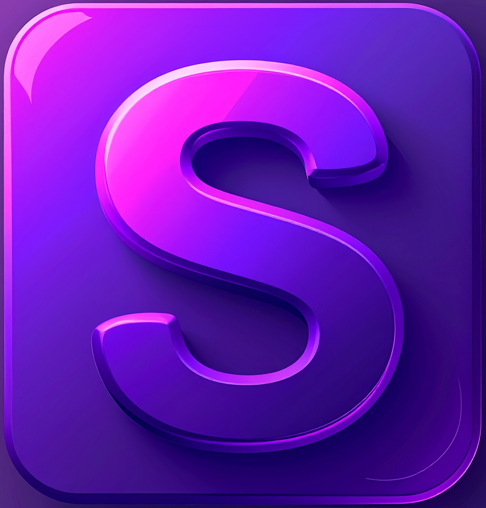
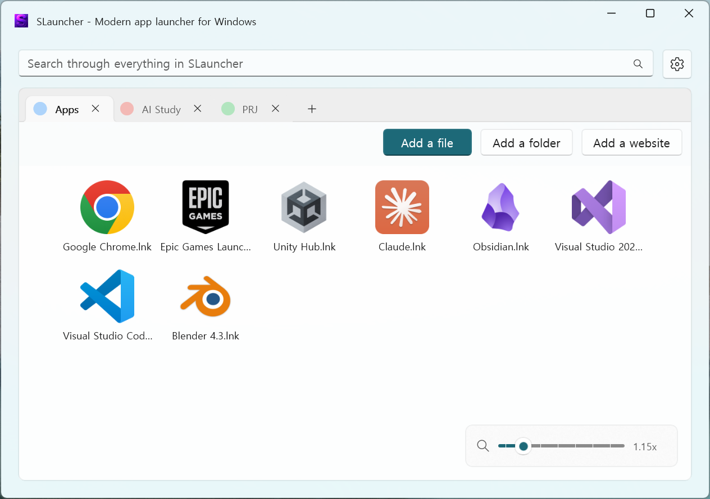
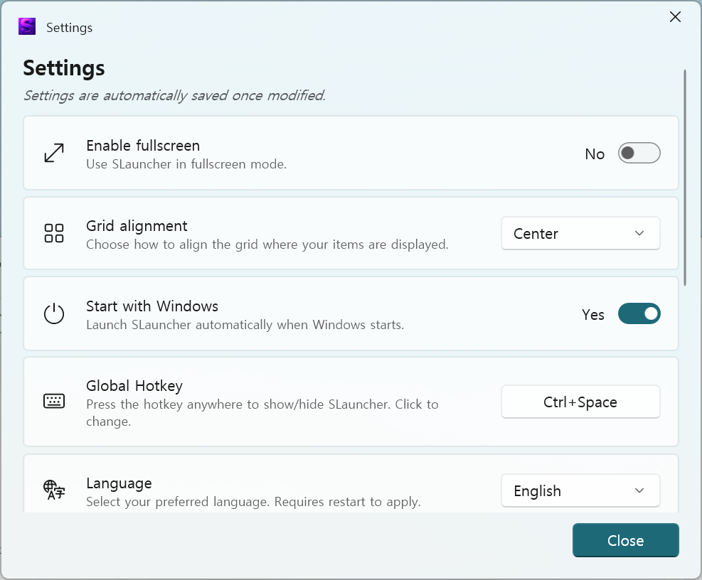

# SLauncher

<div align="center">



**Windows用モダンマルチ言語アプリランチャー**

[](LICENSE)
[](https://dotnet.microsoft.com/download)
[](https://microsoft.github.io/microsoft-ui-xaml/)

**言語:** [English](README.md) • [한국어](README.ko-KR.md) • [日本語](README.ja-JP.md)

[機能](#-機能) • [インストール](#-インストール) • [使い方](#-使い方) • [ソースからビルド](#%EF%B8%8F-ソースからビルド)

---

⭐ **このプロジェクトが役に立ったら、[GitHub](https://github.com/siriz/SLauncher)でスターをお願いします!**

</div>

---

## 🌟 機能

### コア機能
- ⚡ **クイック起動** - お気に入りのアプリ、フォルダ、ウェブサイトを即座に起動
- 🔑 **グローバルホットキー** - どこからでもランチャーを呼び出し（デフォルト: `Ctrl + Space`）
- 📑 **タブ構成** - 複数のタブでアイテムを整理（名前と色をカスタマイズ可能）
- 🖱️ **ドラッグ＆ドロップ** - 直感的なアイテム管理
- 🔍 **スマート検索** - アイテム検索または直接ファイル/フォルダ/URLを開く
- 📐 **アイコンスケーリング** - スライダーまたは`Ctrl + マウスホイール`（0.25x - 6.00x）

### 多言語サポート
- 🇺🇸 **English**（英語）
- 🇰🇷 **한국어**（韓国語）
- 🇯🇵 **日本語**
- ⚡ リアルタイム言語切り替え - 再起動不要！

### モダンUI
- 🎨 **Windows 11デザイン** - Mica/Acrylic効果を使用したネイティブWinUI 3
- 🌓 **テーマサポート** - システムダーク/ライトテーマに自動追従
- 📺 **フルスクリーンモード** - 没入型ランチャー体験
- ⚖️ **グリッド配置** - 左または中央配置を選択
- 🎨 **タブカラー** - 8つのプリセットカラーでタブをカスタマイズ

### パフォーマンスと移植性
- 📦 **ポータブル** - 実行ファイルフォルダにすべてのデータを保存（`UserCache/`）
- 🚀 **高速起動** - キャッシュされたデータで即座にロード
- 💾 **ファビコンキャッシュ** - ウェブサイトアイコンをローカルにキャッシュ
- 🪶 **軽量** - 最小限のリソース使用

---

## 📸 スクリーンショット

### メイン画面
<div align="center">

<p><i>タブ構成でクリーンで直感的なインターフェース</i></p>
</div>

### 設定画面
<div align="center">

<p><i>多言語サポートを含む包括的な設定</i></p>
</div>

---

## 📦 インストール

### システム要件
- **Windows 10** バージョン1809（ビルド17763）以降
- **Windows 11**（最高の体験のために推奨）
- **.NET 8.0ランタイム**（自己完結型ビルドに含まれる）

### クイックインストール
1. [Releases](https://github.com/siriz/SLauncher/releases)から最新リリースをダウンロード
2. ZIPファイルを任意のフォルダに解凍
3. `SLauncher.exe`を実行
4. （オプション）設定で「Windowsと一緒に起動」を有効化

### ポータブルモード
すべての設定とデータは実行ファイルの隣の`UserCache`フォルダに保存されます:
```
SLauncher/
├── SLauncher.exe
└── UserCache/
    ├── Settings/    # ユーザー設定
    ├── Files/       # アイテムデータ
    └── FaviconCache/  # ウェブサイトアイコン
```

---

## 🎮 使い方

### アイテムの追加

#### 方法1: ボタン
- **ファイル追加**: ボタンをクリックして`.exe`、`.lnk`、または任意のファイルを選択
- **フォルダ追加**: ボタンをクリックしてフォルダを選択
- **ウェブサイト追加**: ボタンをクリックしてURLを入力（例: `https://github.com`）

#### 方法2: ドラッグ＆ドロップ
- ファイル、フォルダ、ショートカットをウィンドウに直接ドラッグ
- タブ間でドラッグしてアイテムを移動
- あるアイテムを別のアイテムにドラッグしてグループを作成

### アイテムの管理

| アクション | 方法 |
|-----------|------|
| **編集** | アイテムを右クリック → 編集 |
| **削除** | アイテムを右クリック → 削除または`Delete`キー |
| **グループ作成** | あるアイテムを別のアイテムにドラッグ |
| **並べ替え** | アイテムを新しい位置にドラッグ |

### タブ管理

#### タブの作成
- タブの隣の**+**ボタンをクリック
- 各タブは異なるアイテムと設定が可能

#### タブオプション（タブを右クリック）
- **名前変更** - タブにカスタム名を付ける
- **色変更** - 8つのプリセットカラーから選択
- **削除** - タブを削除（アイテムがある場合は確認が必要）

### 検索

検索ボックスは複数の入力タイプをサポートします:

| 入力タイプ | 例 | 結果 |
|-----------|-----|------|
| **アイテム名** | `メモ帳` | すべてのアイテムを検索 |
| **ファイルパス** | `C:\Windows\notepad.exe` | ファイルを直接開く |
| **フォルダパス** | `C:\Users\Documents` | エクスプローラーでフォルダを開く |
| **ウェブサイトURL** | `https://google.com` | デフォルトブラウザで開く |
| **検索クエリ** | `search:キーワード` | デフォルトブラウザで検索 |

### キーボードショートカット

| ショートカット | アクション |
|---------------|-----------|
| `Ctrl + Space` | ランチャー表示/非表示（設定で変更可能） |
| `Ctrl + マウスホイール` | アイコンサイズ調整（ウィンドウ全体で動作） |
| `Delete` | 選択したアイテムを削除 |
| `Esc` | ランチャーを閉じる（フルスクリーンモード） |
| `Enter` | 最初の検索結果を開く |

### アイコンスケーリング

次の方法でアイコンサイズを調整:
- 右下の**スライダー**
- ウィンドウのどこでも**Ctrl + マウスホイール**
- 範囲: 0.25x ～ 6.00x

---

## ⚙️ 設定

### 一般設定
- **フルスクリーン有効化** - フルスクリーンモードでランチャーを使用
- **グリッド配置** - 左（幅を埋める）または中央（固定幅）
- **Windowsと一緒に起動** - 起動時に自動実行
- **グローバルホットキー** - 表示/非表示ホットキーのカスタマイズ
  - 修飾キー: Ctrl、Alt、Shift、Ctrl+Shift、Ctrl+Alt
  - キー: Space、Tab、Enter、Esc、F1-F4
- **言語** - 優先言語を選択（英語、韓国語、日本語）

### キャッシュ管理
- **キャッシュサイズ表示** - ファビコンキャッシュ使用量を監視
- **キャッシュクリア** - すべてのキャッシュされたウェブサイトアイコンを削除
- **キャッシュフォルダを開く** - キャッシュディレクトリに直接アクセス
- **キャッシュ場所** - ポータブル: `UserCache\FaviconCache\`

---

## 🛠️ ソースからビルド

### 前提条件
- **Visual Studio 2022**（17.8以降）
  - ワークロード: 「.NETデスクトップ開発」
  - コンポーネント: 「Windows App SDK C#テンプレート」
- **Windows App SDK 1.5**以降
- **.NET 8.0 SDK**

### クローンとビルド

```bash
# リポジトリをクローン
git clone https://github.com/siriz/SLauncher.git
cd SLauncher

# NuGetパッケージを復元
dotnet restore

# ソリューションをビルド
dotnet build -c Release

# またはVisual Studioで開く
start SLauncher.sln
```

### プロジェクト構造

```
SLauncher/
├── SLauncher/   # メインWinUI 3プロジェクト
│   ├── Classes/      # コアクラス
│   │   ├── LocalizationManager.cs   # 多言語サポート
│   │   ├── UserSettingsClass.cs  # 設定管理
│   │   ├── GlobalHotkeyManager.cs # ホットキー登録
│   │   └── IconHelpers.cs # アイコン抽出とキャッシュ
│   ├── Controls/     # カスタムコントロール
│   │   ├── GridViewTile.xaml # アプリタイルコントロール
│   │   ├── GridViewTileGroup.xaml   # グループコントロール
│   │   └── AboutSectionControl.xaml # Aboutページ
│   ├── Strings/      # 多言語リソース
│   │   ├── en-US/Resources.resw     # 英語
│   │   ├── ko-KR/Resources.resw     # 韓国語
│   │   └── ja-JP/Resources.resw     # 日本語
│   ├── MainWindow*.cs    # メインウィンドウ（部分クラス）
│   │   ├── MainWindow.xaml.cs       # メインロジック
│   │   ├── MainWindow.UI.cs     # UI管理
│   │   ├── MainWindow.Tabs.cs # タブ管理
│   │   ├── MainWindow.Items.cs      # アイテム管理
│   │   ├── MainWindow.DragDrop.cs   # ドラッグ＆ドロップ
│   │   ├── MainWindow.Search.cs     # 検索ロジック
│   │   └── MainWindow.Hotkeys.cs    # ホットキーとトレイ
│   └── SettingsWindow*.cs  # 設定ウィンドウ（部分クラス）
│  ├── SettingsWindow.xaml.cs       # メインロジック
│       ├── SettingsWindow.Localization.cs # 言語UI
│       ├── SettingsWindow.Cache.cs    # キャッシュ管理
│   ├── SettingsWindow.Hotkey.cs# ホットキー設定
│       └── SettingsWindow.Settings.cs   # 設定トグル
└── WinFormsClassLibrary/   # ヘルパーライブラリ（ファイルダイアログ）
```

### 部分クラスパターン

`MainWindow`と`SettingsWindow`の両方が、より良いコード構成のために部分クラスを使用します:
- 各部分クラスファイルが特定の機能領域を処理
- コードのナビゲーションと保守が容易
- 一貫性のために`MainWindow`と同じパターンに従う

---

## 📄 ライセンス

このプロジェクトはMITライセンスの下でライセンスされています - 詳細は[LICENSE](LICENSE)ファイルを参照してください。

### サードパーティライブラリ
- **WinUI 3** - MITライセンス
- **CommunityToolkit.WinUI** - MITライセンス
- **WinUIEx** - MITライセンス
- **System.Drawing.Common** - MITライセンス

---

## 🙏 謝辞

- **ベース**: Apollo199999999の[LauncherX](https://github.com/Apollo199999999/LauncherX)
- **UIフレームワーク**: [WinUI 3](https://microsoft.github.io/microsoft-ui-xaml/)
- **Community Toolkit**: [Windows Community Toolkit](https://github.com/CommunityToolkit/Windows)
- **ウィンドウ管理**: [WinUIEx](https://github.com/dotMorten/WinUIEx)
- **アイコン**: [Segoe Fluent Icons](https://docs.microsoft.com/en-us/windows/apps/design/style/segoe-fluent-icons-font)

---

## 📊 変更履歴

### v1.0.0（最新）
- ✨ 多言語サポート（英語、韓国語、日本語）
- ✨ リアルタイム言語切り替え
- ✨ より良いコード構成のための部分クラスリファクタリング
- ✨ ウィンドウ全体でCtrl+マウスホイールアイコンスケーリング
- 🐛 グリッド配置の多言語化を修正
- 🐛 キャッシュ管理サブテキストの多言語化を修正
- 📝 包括的な多言語化（言語ごとに90以上の文字列）

### 以前のバージョン
- 色付きタブ管理
- グローバルホットキーサポート
- システムトレイ統合
- ファビコンキャッシング

---

<div align="center">

**Windowsパワーユーザーのために❤️で作られました**

[⬆ トップに戻る](#slauncher)

</div>
