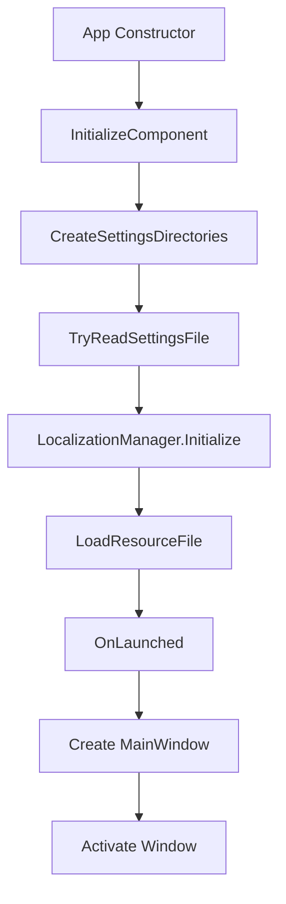

# SLauncher - Multi-Language Support Implementation

## ?? Overview

SLauncher now supports **real-time language switching** without requiring application restart.

### Supported Languages
- ???? **English** (en-US)
- ???? **и措橫** (ko-KR)
- ???? **擨塓槧** (ja-JP)

---

## ? Features

### 1. **LocalizationManager**
- Centralized resource management
- Automatic language detection from system
- Event-driven architecture for real-time updates
- Fallback to English for unsupported languages

### 2. **Real-Time Language Switching**
- No application restart required
- Instant UI updates across all windows
- Automatic settings persistence

### 3. **Resource Files**
- 42+ localized strings per language
- UTF-8 encoding for proper character display
- Organized in `Strings/{language}/Resources.resw`

---

## ??? Architecture

### Class Structure

```
SLauncher.Classes
戍式式 LocalizationManager.cs       # Core localization system
戍式式 LocalizationDiagnostics.cs   # Debugging utilities
戍式式 UserSettingsClass.cs         # Settings persistence
戌式式 TabData.cs  # Tab data structure

SLauncher
戍式式 App.xaml.cs                   # App initialization
戍式式 MainWindow.xaml.cs            # Main window (partial classes)
弛   戍式式 MainWindow.UI.cs          # UI management
弛   戍式式 MainWindow.Tabs.cs        # Tab management
弛   戍式式 MainWindow.Items.cs       # Item management
弛   戍式式 MainWindow.Search.cs      # Search functionality
弛   戍式式 MainWindow.DragDrop.cs    # Drag & drop
弛   戌式式 MainWindow.Hotkeys.cs     # Hotkeys & tray
戌式式 SettingsWindow.xaml.cs # Settings UI
```

### Initialization Flow



---

## ?? Implementation Details

### 1. **LocalizationManager Event System**

```csharp
public static event EventHandler LanguageChanged;

public static void ApplyLanguage(string languageCode)
{
    _currentLanguage = languageCode;
    LoadResourceFile(languageCode);
    
    // Notify all subscribers
  LanguageChanged?.Invoke(null, EventArgs.Empty);
}
```

### 2. **MainWindow Language Update**

```csharp
public MainWindow()
{
    this.InitializeComponent();
    
  // Subscribe to language changes
    LocalizationManager.LanguageChanged += OnLanguageChanged;
}

private void OnLanguageChanged(object sender, EventArgs e)
{
    DispatcherQueue.TryEnqueue(() =>
    {
        InitializeLocalizedUI(); // Update all UI text
    });
}
```

### 3. **Settings Window Integration**

```csharp
private void LanguageComboBox_SelectionChanged(object sender, SelectionChangedEventArgs e)
{
    if (LanguageComboBox.SelectedItem is ComboBoxItem selectedItem)
    {
        string newLanguageCode = selectedItem.Tag?.ToString();
     
        // Apply immediately without restart
     LocalizationManager.ChangeLanguage(newLanguageCode);
        UpdateSettingsWindowUI();
    }
}
```

---

## ?? Key Technical Decisions

### 1. **Why Remove `ApplicationLanguages.PrimaryLanguageOverride`?**

**Problem:**
```csharp
// This fails during App constructor
ApplicationLanguages.PrimaryLanguageOverride = languageCode;
// Exception: Operation is not valid due to the current state of the object
```

**Solution:**
- Remove the override setting
- Use custom resource loading instead
- Works perfectly for our use case

### 2. **Why Move MainWindow Creation to OnLaunched()?**

**Problem:**
```csharp
// In App constructor - XAML exceptions not caught properly
MainWindow = new MainWindow();
```

**Solution:**
```csharp
// In OnLaunched() - Exceptions handled correctly
protected override void OnLaunched(LaunchActivatedEventArgs args)
{
    MainWindow = new MainWindow();
    MainWindow.Activate();
}
```

### 3. **Why Use Event System Instead of Restart?**

**Better UX:**
- ? Instant feedback
- ? No data loss
- ? Smoother experience
- ? Old way: "Please restart" dialog

---

## ?? Localized Resources

### Resource Keys (42 total)

#### Main Window
- `AppTitle` - Application title
- `SearchPlaceholder` - Search box placeholder
- `AddFileButton` - Add file button
- `AddFolderButton` - Add folder button
- `AddWebsiteButton` - Add website button
- `EmptyNoticeTitle` - Empty state title
- `EmptyNoticeMessage` - Empty state message
- `LoadingMessage` - Loading indicator
- `DragDropMessage` - Drag & drop hint

#### Tab Management
- `DefaultTabName` - Default tab name
- `NewTabName` - New tab name template
- `TabRename` - Rename menu item
- `TabChangeColor` - Change color menu
- `TabDelete` - Delete menu item
- `TabDeleteTitle` - Delete confirmation title
- `TabDeleteMessage` - Delete confirmation message

#### Tab Colors
- `ColorDefault` - Default (no color)
- `ColorRed`, `ColorOrange`, `ColorYellow`
- `ColorGreen`, `ColorBlue`, `ColorIndigo`
- `ColorPurple`, `ColorPink`, `ColorGray`

#### Settings
- `SettingsTitle` - Settings window title
- `SettingsLanguage` - Language section
- `SettingsLanguageDescription` - Language help text
- `SettingsRestartRequired` - Restart notice (removed)

#### Common Buttons
- `ButtonOK`, `ButtonCancel`
- `ButtonDelete`, `ButtonClose`

---

## ?? Testing

### Manual Test Cases

1. **Language Switching**
   ```
   ? Open Settings
   ? Change language (EN ⊥ KO ⊥ JP)
   ? Verify MainWindow title updates
   ? Verify Settings window updates
   ? Verify tab colors update
   ? Close and reopen - language persists
   ```

2. **First Run**
   ```
   ? Delete settings.json
   ? Launch app
   ? Verify system language detected
   ? Verify fallback to English if unsupported
   ```

3. **Edge Cases**
   ```
   ? Invalid language code in settings
   ? Missing resource file
   ? Corrupted resource file
   ? Multiple rapid language changes
   ```

---

## ?? Known Issues & Solutions

### Issue 1: "AppTitle" Displayed Instead of Translation

**Cause:** LocalizationManager initialized after MainWindow

**Solution:**
```csharp
// App.xaml.cs - Correct order
LocalizationManager.Initialize();  // 1. First
MainWindow = new MainWindow();      // 2. Then
```

### Issue 2: Resources Not Loading

**Cause:** Resource files not copied to output

**Solution:**
```xml
<!-- SLauncher.csproj -->
<ItemGroup>
  <Content Include="Strings\**\*.resw">
    <CopyToOutputDirectory>PreserveNewest</CopyToOutputDirectory>
  </Content>
</ItemGroup>
```

### Issue 3: Korean/Japanese Characters Showing as `???`

**Cause:** File encoding not UTF-8

**Solution:**
- Save all `.resw` files as UTF-8 (without BOM)
- Use Visual Studio or UTF-8 compatible editor

---

## ?? File Structure

```
SLauncher/
戍式式 Strings/
弛   戍式式 en-US/
弛   弛   戌式式 Resources.resw      # English resources
弛   戍式式 ko-KR/
弛   弛   戌式式 Resources.resw      # Korean resources (и措橫)
弛   戌式式 ja-JP/
弛       戌式式 Resources.resw   # Japanese resources (擨塓槧)
戍式式 Classes/
弛   戍式式 LocalizationManager.cs
弛   戍式式 LocalizationDiagnostics.cs
弛   戌式式 UserSettingsClass.cs
戍式式 App.xaml.cs
戍式式 MainWindow.xaml.cs
戌式式 SettingsWindow.xaml.cs
```

---

## ?? Future Enhancements

### Potential Improvements

1. **More Languages**
   - French (fr-FR)
   - German (de-DE)
   - Spanish (es-ES)
   - Chinese (zh-CN)

2. **Advanced Features**
   - Language pack download
   - Community translations
   - Pluralization support
   - Date/time formatting

3. **Developer Tools**
   - Translation editor
   - Missing key detector
   - Usage statistics

---

## ?? References

### Documentation
- [WinUI 3 Localization](https://learn.microsoft.com/en-us/windows/apps/windows-app-sdk/localization)
- [.resw File Format](https://learn.microsoft.com/en-us/windows/uwp/app-resources/localize-strings-ui-manifest)

### Related Files
- `LOCALIZATION-FINAL-FIX-COMPLETE.md`
- `TAB-FEATURE-COMPLETE.md`
- `SETTINGS-BUTTON-DOUBLE-CLICK-FIX.md`

---

## ?? Credits

Implemented as part of SLauncher v2.1.2+ development.

**Contributors:**
- Multi-language architecture
- Real-time switching implementation
- Resource file translations
- Documentation

---

## ?? License

This feature is part of SLauncher and follows the project's license terms.

---

**Last Updated:** 2025-01-26
**Version:** 2.1.2+
